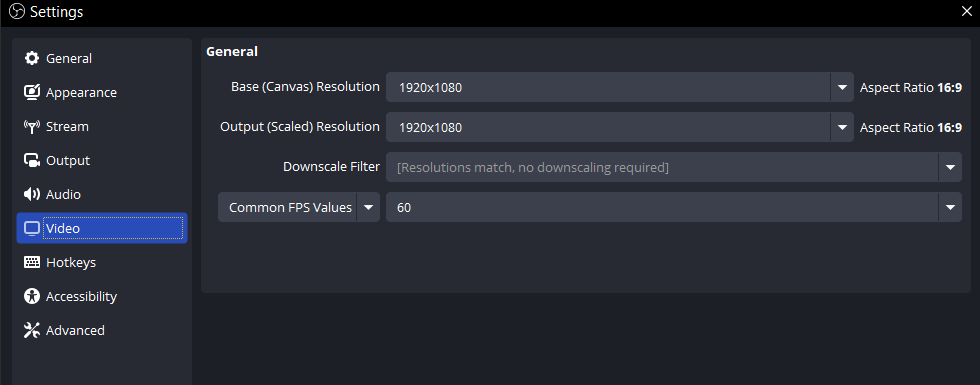
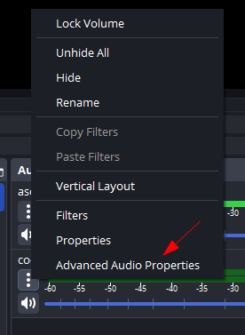

OBS is a very useful tool in and of itself, especially if you're only streaming to one platform. This is gonna be a basic rundown of most of the stuff you'll need for setting up a stream in OBS

# Setting up the actual streaming part

When you first open OBS, it's gonna look something like this:

Basically just a preview screen on the top, some docks on the bottom. 
It might prompt you with a dialogue box asking if you're going to be streaming, recording, or using the virtual camera. If it does, you can run through that. 

To get connected to your streaming platform, you're going to open "settings" then go to "Stream"

Under that, there's a category for destination - if you're only streaming to one platform, that's where you'll pick your destination. If you plan to stream to multiple platforms at once, you'll either need to choose Restream.io (ew) or use a plugin (more difficult)

You can choose to connect to twitch by logging in, or by putting in your stream key. Both work, stream key is less secure. 
At the bottom of this page there is also an option to include twitch addons so you can see emojis from better ttv and FrankerFaceZ

Now after applying those settings, you should see a chat dock pop up, and a stream settings dock pop up. You can move these into any part of the dock area, I like to put it on the side of the preview like this: 

Depending on what you're streaming, if you have affiliate or not, various other things, your stream settings in and of themselves are gonna be different. 

### Video Settings: 

I wouldn't suggest downscaling your video yourself, as twitch will do that automatically. If you're doing something that is relatively slow (coding, for example) you don't really need 60FPS, but usually if you're playing a game, or doing stuff that has a lot of video you'll want 60 FPS. 

### Output Settings:

If you don't enable enhanced broadcasting, you can adjust your streaming settings yourself

This allows you to use Twitch Vod Tracks - which means you can have specific audio sources cut out from the vod. 

so if you have some music you want on stream but not in the vod, you can right click on the audio source, go to advanced audio properties

And then remove the tick mark from the track you don't want it to be on. This affects the vod being saved onto your computer, I don't believe it affects the vod on twitch, but I may be wrong

## Adding Custom Docks

To add custom docks, you basically just need a link. I like to add my mod actions and quick actions from twitch so I don't have to go on twitch to do stuff or look at history. How to do this (with twitch stuff) is to go to the stream manager

hit the 3 dots on whatever thing you want to add to your OBS docks, and scroll to where it says 'pop out (thing)'

The popped out version will have a link at the top. You will copy that link

Then on OBS you're gonna click the button that says 'Docks' (next to view and profile)

Then you click 'custom browser docks'

Then you add a name and the url for the dock
To enable these docks, you'll open the docks tab again, and the custom ones will show below the default ones

## Adding Chat Overlay
There's a few different ways you can add chat overlay to your stream, I like https://showmy.chat/ because it removes deleted messages, which most chat overlays do not do.

To add your chat overlay you'll want to go to the scene you'll be putting it on, and add a source, and click on browser:

Then you will paste the link to whatever overlay you're using in the 'URL' spot:

if you have a specific height and width you want, it's usually best to set it in this, rather than resizing the element, since resizing the element will cause it to lose quality and be more difficult to read

## Adding Alerts
There's a bunch of different ways to add alerts, Stream Elements alerts and Twitch alerts are pretty easy if you have basic alerts. Depending on how you have your alerts 

#### Twitch Alerts:

On your creator dashboard, there's an 'Alerts' tab

You can create different versions if you like have themed alerts for different seasons or something.

Editing alerts in the Twitch Alerts page is pretty straightforward, unless you are trying to customize the CSS/HTML, then it gets really annoying. 

You can also add alerts for goals and channel point redeems here. 

#### Stream Elements:

Stream elements also has an overlay creator, but it's more difficult to design specific alerts. If you just want to have one single overlay and not deal with figuring out a bunch of browser sources, though, stream elements is likely what you're going to want.

### Adding Sources - general applications

Usually, if you want a specific application to be shown, you will use the 'window' source. 

You will have options for what window to capture, the capture method, and window match priority, as well as if the audio should be captured, and if the cursor should be captured. 

Window match is important for when you're starting OBS back up, the match priority of `match title otherwise find window of same type` will not, for instance, find discord again after restarting >\_> you gotta use `match title otherwise find window of same executable` if you want discord to be consistently caught by the window source 

### Adding a PNG-Tuber

Depending on what software you want to use for your PNG-Tuber, you will use different ways for displaying it on stream

##### Veadotube-mini:
You can set a background with this or make the background transparent. If you are not using a transparent background, you can just use a window capture. If you are using the transparent background, you'll want to use the game capture:

You'll want to set the mode to 'specific window', and then checkmark 'allow transparency'

## Uh other things to know:

**Studio mode**
- Studio mode allows you to make changes to your layout, or switch scenes without it being changed on the stream immediately. 

**Looping back audio**
Click the settings icon on the audio source you wanna hear, and then under 'audio monitoring' set it to whatever you want it to be set to.  

**You can use a scene as a source**
This is useful if you wanna set up your audio in one scene so it can be used in different scenes and don't wanna set it all up separately or something - or if you're insane like me and have a bunch of weird scenes that are redeemable

**Audio mixer bar is your friend, but also don't trust it too much**

Audio mixer bar is very useful for having a quick reference at how loud things are - but the red bar is not really accurate - idk they don't make sense to me

**OBS Plugins**
There's thousands of plugins for OBS for things, if you like to automate stuff, [Advanced Scene Switcher](https://obsproject.com/forum/resources/advanced-scene-switcher.395/) is super amazing, you're able to make customizable macros for stuff

[Media Playlist Source](https://obsproject.com/forum/resources/media-playlist-source.1765/) is also a good one

https://obsproject.com/forum/resources/